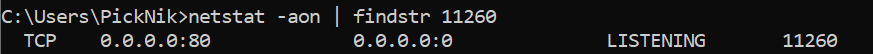

# Networking Configuration

This document covers various options to configure the network connection between the ROS2 computer and the RWS server. For general driver setup instructions, see [the README](./README.md).

## Changing the RWS port

RWS by default runs on port 80 of the RobotStudio computer. If you want to change this, (ex. if port 80 is taken by another application), you can do this by navigating to and opening this file:

`C:\Users\<USERNAME>\AppData\Local\ABB\RobotWare\RobotWare_<VERSION NUMBER>\system\appweb.conf`

There should be a line that says `Listen -1` line - change the `-1` to your desired port number and save the file.

To verify the port used by RWS, open Task Manager and click the `Details` tab. Look for `RobVC.exe` and note the PID. Open command prompt, and run the following command, substituting `<PID_NUMBER>` with the PID from earlier.

`netstat -aon | findStr <PID NUMBER>`

You should see something like the following - in this case, RWS is listening on port 80:



Note that if you change the RWS port, you may need to change the `rws_port` parameter in the [robot description file](../robot_specific_config/abb_irb1200_support/urdf/irb1200.ros2_control.xacro) to match the port you selected.

See [this forum post](https://forums.robotstudio.com/discussion/12177/how-to-change-the-listening-port-of-the-virtual-controller-robotware-6-x-and-7-x) for more detail.

## Adding the local computer to the virtual controller whitelist

To access the virtual controller with RWS from a networked ROS2 computer, you will need to whitelist the ROS2 computer's IP on the RobotStudio computer. Without this whitelist, you will get an RAPI Unidentified Error when trying to access the controller. You can verify this if you try to navigate to `<ROBOTSTUDIO_COMPUTER_IP>:80` from the ROS2 computer. The default credentials are:

```
Username: Default User
Password: robotics
```

To whitelist the ROS2 computer's IP, on the RobotStudio computer, navigate to:

`C:\Users\<USER>\AppData\Roaming\ABB Industrial IT\Robotics IT\RobVC\`

Look for a file called `vcconf.xml`. Create it if it does not exist.

Paste the following into`vcconf.xml`:

```
<VCConfiguration>
<RemoteVCConfiguration PublicationEnabled="true" />
<hosts>
<host ip="ROS2_COMPUTER_IP"/>
</hosts>
</VCConfiguration>
```

Change ROS2_COMPUTER_IP to the IP of the ROS2 computer. Up to 10 IP addresses can be whitelisted by adding additional `<host ip="..."/>` lines. Restart RobotStudio after the update.

See [this forum post](https://forums.robotstudio.com/discussion/12082/using-robotwebservices-to-access-a-remote-virtual-controller) for more details.

## Configuring SSH port forwarding

If you'd prefer to avoid the [whitelisting solution](#adding-the-local-computer-to-the-virtual-controller-whitelist), you can also use ssh port forwarding.

[Install "OpenSSH Server"](https://docs.microsoft.com/en-us/windows-server/administration/openssh/openssh_install_firstuse#install-openssh-using-windows-settings) on the RobotStudio computer.

Start the SSH server by running the following command in PowerShell as an administrator:

```Start-Service sshd```

On the ROS2 computer, set up the SSH port forward by typing the following command into the terminal:

```ssh -L <DESTINATION_PORT>:localhost:<RWS_PORT> <ROBOTSTUDIO_USER>@<ROBOTSTUDIO_IP>```

- Change `<DESTINATION_PORT>` to a port of your choice. Note that `sudo` is required to use ports 0-1023, as they are reserved.
- Change `<RWS_PORT>` to the port used for RWS on the RobotStudio machine, typically 80.
- Change `<ROBOTSTUDIO_USER>` to the Windows username on the RobotStudio computer. This account must have a password.
- Change `<ROBOTSTUDIO_IP>` to the IP of the RobotStudio computer.

Enter the Windows login password for the `<ROBOTSTUDIO_USER>` account when prompted.

This will allow you to access RWS on the ROS2 computer on `127.0.0.1:<DESTINATION_PORT>`. When launching ROS, use this value for rws_ip: `127.0.0.1`. The full launch command would be:

    ros2 launch abb_bringup abb_control.launch.py description_package:=abb_irb1200_support description_file:=irb1200_5_90.xacro launch_rviz:=false moveit_config_package:=abb_irb1200_5_90_moveit_config use_fake_hardware:=false rws_ip:=127.0.0.1 rws_port:=<DESTINATION_PORT>

Replace `<DESTINATION_PORT>` with the port you selected earlier.
