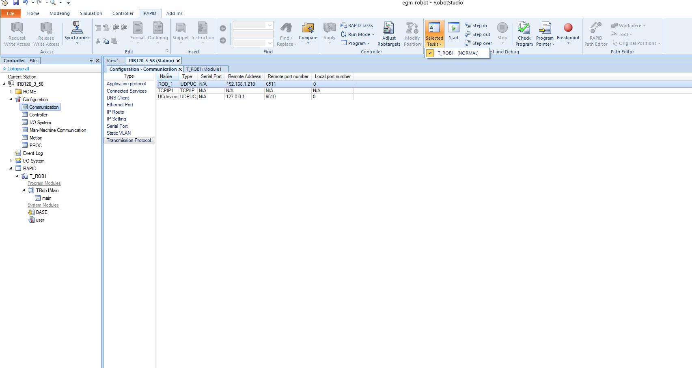

# Building the package in ROS 2

Create a ROS 2 workspace per the online tutorial. Clone this package into your workspace's `src` directory.

Import package dependencies:

    sudo apt update
    sudo apt dist-upgrade
    rosdep update
    cd src
    vcs import < abb_ros2/abb.repos
    rosdep install -r --from-paths . --ignore-src --rosdistro $ROS_DISTRO -y

Build the package:

    cd <COLCON_WORKSPACE>
    colcon build

Quickly verify the build by launching RViz and viewing the robot:

    ros2 launch abb_irb1200_support view_robot.launch.py

# Simulating a robot in ROS 2

For this simulation, ROS 2 simulates the robot controllers. RobotStudio or a physical robot are not needed.

    ros2 launch abb_bringup abb_control.launch.py description_package:=abb_irb1200_support description_file:=irb1200_5_90.xacro launch_rviz:=false moveit_config_package:=abb_irb1200_5_90_moveit_config use_fake_hardware:=true

After launching the controllers, launch MoveIt:

    ros2 launch abb_bringup abb_moveit.launch.py robot_xacro_file:=irb1200_5_90.xacro support_package:=abb_irb1200_support moveit_config_package:=abb_irb1200_5_90_moveit_config moveit_config_file:=abb_irb1200_5_90.srdf.xacro

# RobotStudio Simulation

The simulation files are a modified version from the [abb_libegm library](https://github.com/ros-industrial/abb_libegm/issues/18#issuecomment-473262645) with some additional details about setting up EGM.

Running this simulation requires two computers communicating over the network: a Windows computer running RobotStudio, and a ROS 2 computer running the driver.

## Packaged Sim

The `robot_studio_resources` directory contains a Pack and Go file for RobotStudio, which packages the station with the virtual controller and add-in configuration. The example Pack and Go files include:

- `IRB1200_5_90.rspag` for a basic EGM setup
- `IRB1200_5_90_EXTAX.rspag` for an example with an external axis
- In the `velocity_control_example folder`, `IRB1200_5_90.rspag` for an example that works with velocity control

To set up the robot using the packaged solution:

1. Download the Pack and Go file onto the computer with RobotStudio
2. Run RobotStudio
3. Under File, select Open
4. Navigate to the folder with the downloaded Pack and Go file and select it

This should open the station with most of the required parameters set up. However, note that network parameters for connecting between the robot and the control computer will likely be different, and will need to be reconfigured. See the [controller configuration step](./RobotStudioSetup.md#controller-configuration) in Setting Up a New Robot to do this.

If you would like to set up your own simulation from scratch, see [Setting Up a New Robot](./RobotStudioSetup.md#setting-up-a-new-robot). For MultiMove, see [Setting Up a New Robot with MultiMove](./RobotStudioSetup.md#setting-up-a-new-multimove-robot)

## Running the Simulation

Once the simulation is set up, either via the Pack and Go or by setting up a new robot, the simulation should be ready to run.

Start the controller under the `RAPID` tab by selecting `T_ROB1` (and `T_EXTAXIS` for the external axis example) as the task under `Selected Tasks`, and pressing the `Start` icon on the ribbon.

The simulation will then try to connect with the ROS 2 driver every few seconds. Once the connection is established, the simulated robot can be controlled from the ROS 2 computer.



## Connecting with ROS 2
Connecting RWS with ROS 2 may require some configuration. See [Networking Configuration](./NetworkingConfiguration.md) for more details.

The driver reqiures some network information to connect to EGM and RWS. This information is stored in the ros2_control [robot description file](../robot_specific_config/abb_irb1200_support/urdf/irb1200.ros2_control.xacro). Change the following lines as required (below configured for an example not using MultiMove):

```
<param name="rws_port">80</param>
<param name="rws_ip">${robotstudio_ip}</param>
<!-- The following parameter is used for non-MultiMove only -->
<param name="egm_port">6511</param>
<!-- The following parameters are used for the MultiMove example only -->
<!-- <param name="rob1egm_port">6511</param> -->
<!-- <param name="extaxegm_port">6512</param> -->
```

- `rws_port` should be the port for RWS
- `rws_ip` is passed in as a launch argument
- `<MECHANICAL_UNIT_GROUP_NAME>egm_port` should match the `Remote port` setting from the RobotStudio controller configuration
     - Change `<MECHANICAL_UNIT_GROUP_NAME>` to match the mechanical unit group name, adding a new `egm_port` parameter for each mechanical unit group
       - In the MultiMove example, they are named `rob1` and `extax`
     - If using the MultiMove example:
        - Comment out the `egm_port` parameter
        - Uncomment the lines for the `rob1egm_port` and `extaxegm_port` parameters (ports 6511 and 6512)
     - If not using MultiMove:
        - Comment out the `rob1egm_port` and `extaxegm_port` parameters
        - Uncommnet the `egm_port` parameter

To launch with RobotStudio, set `use_fake_hardware:=false` and `rws_ip:=<ROBOTSTUDIO_IP>`, substituting `<ROBOTSTUDIO_IP>` with the IP of the RobotStudio computer. As far as ROS is aware, RobotStudio is a real robot:

    ros2 launch abb_bringup abb_control.launch.py description_package:=abb_irb1200_support description_file:=irb1200_5_90.xacro launch_rviz:=false moveit_config_package:=abb_irb1200_5_90_moveit_config use_fake_hardware:=false rws_ip:=<ROBOTSTUDIO_IP>

After launching the controllers, launch MoveIt:

    ros2 launch abb_bringup abb_moveit.launch.py robot_xacro_file:=irb1200_5_90.xacro support_package:=abb_irb1200_support moveit_config_package:=abb_irb1200_5_90_moveit_config moveit_config_file:=abb_irb1200_5_90.srdf.xacro


## Connecting to RWS

RWS is a platform that allows interaction with the robot controller over HTTP, which is used by the driver to get information about the robot. Note that only RWS 1.0 is supported - RobotWare 7.0 and higher use RWS 2.0 and are not currently supported.

# More Info
- [Robot Studio Setup Guide](./RobotStudioSetup.md)
- [Network Configuration](./NetworkingConfiguration.md)
- [Troubleshooting](./Troubleshooting.md)
- [RWSQuickStart](./RWSQuickStart.md)
