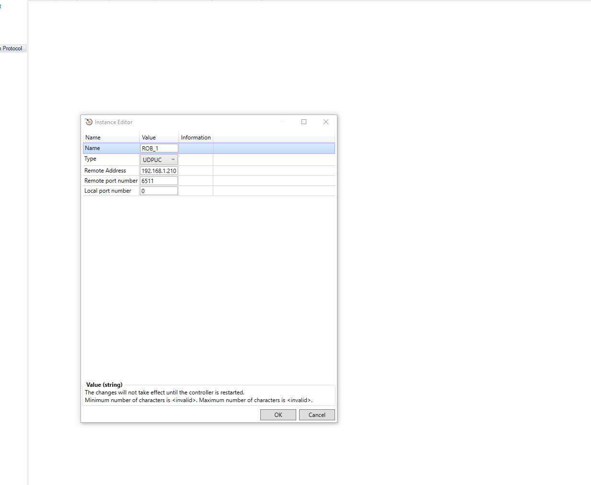
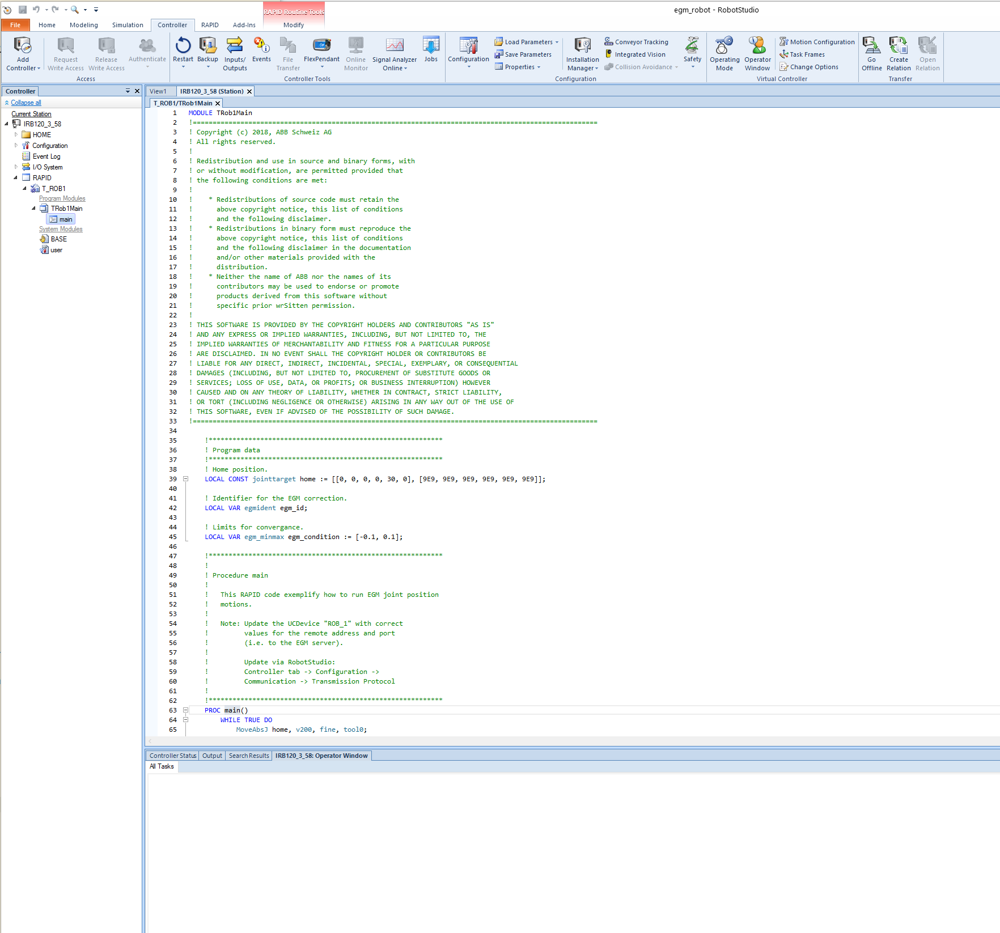

# Building the package in ROS2

Create a ROS2 workspace per the online tutorial. Clone this package into /src.

Import package dependencies:

    sudo apt update
    sudo apt dist-upgrade
    rosdep update
    cd /src
    vcs import < abb_ros2/abb.repos
    rosdep install -r --from-paths . --ignore-src --rosdistro $ROS_DISTRO -y

Quickly verify the build by launching RViz and viewing the robot:

    ros2 launch abb_irb1200_support view_robot.launch.py

# Simulating a robot in ROS2

For this simulation, ROS2 simulates the robot controllers. RobotStudio or a physical robot are not needed.

    ros2 launch abb_bringup abb_control.launch.py description_package:=abb_irb1200_support description_file:=irb1200_5_90.xacro launch_rviz:=false moveit_config_package:=abb_irb1200_5_90_moveit_config use_fake_hardware:=true

After launching the controllers, launch MoveIt:

    ros2 launch abb_bringup abb_moveit.launch.py robot_xacro_file:=irb1200_5_90.xacro support_package:=abb_irb1200_support moveit_config_package:=abb_irb1200_5_90_moveit_config moveit_config_file:=abb_irb1200_5_90.srdf.xacro

# RobotStudio Simulation

The simulation files are a modified version from the [abb_libegm library](https://github.com/ros-industrial/abb_libegm/issues/18#issuecomment-473262645) with some additional details about setting up EGM. 

Running this simulation requires two computers communicating over the network: a Windows computer running RobotStudio, and a ROS2 computer running the driver.

## Packaged Sim

The `robot_studio_resources` directory contains a Pack and Go file for RobotStudio, which packages the station with the virtual controller and add-in configuration. To set up the robot using the packaged solution:

1. Download `IRB1200_5_90.rspag` onto the computer with RobotStudio
2. Run RobotStudio
3. Under File, select Open
4. Navigate to the folder with the downloaded Pack and Go file and select it

This should open the station with most of the required parameters set up. However, note that network parameters for connecting between the robot and the control computer will likely be different, and will need to be reconfigured. See Step 3 in [Setting Up a New Robot](#setting-up-a-new-robot) to do this.

## Setting Up a New Robot:

These steps cover how to set up a new robot in RobotStudio to work with the ABB driver. If using the Pack and Go, skip to step 3 for network configuration, and then to step 6 to start the controller.

1. Open RobotStudio and create a new solution by selecting File --> New --> Solution with Station and Virtual Controller. Make sure you have `Customize options` selected.


2. In the window that pops up for controller customization, add EGM to the controller. This can be done by selecting `Engineering Tools` on the sidebar, and selecting the following options:
- `689-1 Externally Guided Motion (EGM)`

For MultiMove support, e.g. for external axes, also select the following:
- `623-1 Multitasking` also under `Engineering Tools`
- `604-1 MultiMove Independent` 

Note that EGM Position Stream does not support MultiMove Coordinated - this means that coordinated, synchronized robot movement is not supported (i.e. for tasks that involve multiple robots working on the same moving work object).


3. Configure the communication settings for the controller to connect with the ROS2 computer. Identify the IP of the ROS2 computer, and the port used for EGM communitcation. The port is set by the `robotstudio_port` hardware parameter in the robot ros2_control description file. To configure the controller, navigate to the `Controller Tab` --> `Configuration` --> `Communication`. On the right, under `Transmission Protocol` right click and `Add new`.


 - Set the name to be `ROB_1`
 - Set the type to `UDPUC`. If you don't see this option, EGM was not added to the controller.
 -  Set the Remote Address to be that of the ROS2 computer. In the Pack and Go file, this is set to `169.254.53.52`, but this will likely need to be changed.
 - Set the Remote port number to match what ROS2 control driver is expecting. In the sample solution, it is set to `6511`.
 - Leave the local port number set to `0`
 - Press OK at the bottom of the window to confirm the changes



4. Add the code from [TRob1Main.mod](../robot_studio_resources/TRob1Main.mod) to the RAPID module. This can be done by right-clicking the `T_ROB1` task on the sidebar (under RAPID), selecting Load Module..., and navigating to the [TRob1Main.mod] file in the file browser.



## Running the simulation

Once the simulation is set up, either via the Pack and Go or by setting up a new robot, the simulation should be ready to run.

Start the controller under the `RAPID` tab by selecting `TRob1Main` as the task under `Selected Tasks`, and pressing the `Start` icon on the ribbon.

The simulation will then try to connect with the ROS2 driver every few seconds. Once the connection is established, the simulated robot can be controlled from the ROS2 computer.


## Connecting with ROS2

The driver reqiures some network information to connect to EGM and RWS. This information is stored in the ros2_control [robot description file](../robot_specific_config/abb_irb1200_support/urdf/irb1200.ros2_control.xacro). Change the following lines as required:

```
<param name="rws_port">80</param>
<param name="rws_ip">127.0.0.1</param>
<param name="rob1egm_port">6511</param>
```

- `rws_port` should be the port for RWS
- `rws_ip` should be the IP address of the RobotStudio computer (see [Adding the local computer to the virtual controller whitelist](#adding-the-local-computer-to-the-virtual-controller-whitelist))
- `<MECHANICAL_UNIT_GROUP_NAME>egm_port` should match the `Remote port` setting from the RobotStudio controller configuration
     - Change `<MECHANICAL_UNIT_GROUP_NAME>` to match the mechanical unit group name - in the sample Pack and Go file, this is `rob1`
     - If not using MultiMove, change the parameter name to `egm_port`

To launch with RobotStudio, set `use_fake_hardware:=false` and `robotstudio_ip:=<ROBOTSTUDIO_IP>`, substituting `<ROBOTSTUDIO_IP>` with the IP of the RobotStudio computer. As far as ROS is aware, RobotStudio is a real robot:

    ros2 launch abb_bringup abb_control.launch.py description_package:=abb_irb1200_support description_file:=irb1200_5_90.xacro launch_rviz:=false moveit_config_package:=abb_irb1200_5_90_moveit_config use_fake_hardware:=false robotstudio_ip:=<ROBOTSTUDIO_IP>

After launching the controllers, launch MoveIt:

    ros2 launch abb_bringup abb_moveit.launch.py robot_xacro_file:=irb1200_5_90.xacro support_package:=abb_irb1200_support moveit_config_package:=abb_irb1200_5_90_moveit_config moveit_config_file:=abb_irb1200_5_90.srdf.xacro

## Connecting to RWS

RWS is a platform that allows interaction with the robot controller over HTTP, which is used by the driver to get information about the robot. Note that only RWS 1.0 is supported - RobotWare 7.0 and higher use RWS 2.0 and are not currently supported.

### Changing the RWS port

RWS by default runs on port 80 of the RobotStudio computer. If you want to change this, (ex. if port 80 is taken by another application), you can do this by navigating to and opening this file:

`C:\Users\<USERNAME>\AppData\Local\ABB\RobotWare\RobotWare_<VERSION NUMBER>\system\appweb.conf`

There should be a line that says `Listen -1` line - change the `-1` to your desired port number and save the file.

To verify the port used by RWS, open Task Manager and click the `Details` tab. Look for `RobVC.exe` and note the PID. Open command prompt, and run the following command, substituting `<PID_NUMBER>` with the PID from earlier.

`netstat -aon | findStr <PID NUMBER>`

You should see something like the following - in this case, RWS is listening on port 80:


Note that if you change the RWS port, you may need to change the `rws_port` parameter in the [robot description file](../robot_specific_config/abb_irb1200_support/urdf/irb1200.ros2_control.xacro) to match the port you selected.

See [this forum post](https://forums.robotstudio.com/discussion/12177/how-to-change-the-listening-port-of-the-virtual-controller-robotware-6-x-and-7-x) for more detail.

### Adding the local computer to the virtual controller whitelist

To access the virtual controller with RWS from a networked ROS2 computer, you will need to whitelist the ROS2 computer's IP on the RobotStudio computer. Without this whitelist, you will get an RAPI Unidentified Error when trying to access the controller. You can verify this if you try to navigate to `<ROBOTSTUDIO_COMPUTER_IP>:80` from the ROS2 computer. The default credentials are:

```
Username: Default User
Password: robotics
```

To whitelist the ROS2 computer's IP, on the RobotStudio computer, navigate to:

`C:\Users\<USER>\AppData\Roaming\ABB Industrial IT\Robotics IT\RobVC\`

Look for a file called `vcconf.xml`. Create it if it does not exist.

Paste the following into`vcconf.xml`:

```
<VCConfiguration>
<RemoteVCConfiguration PublicationEnabled="true" />
<hosts>
<host ip="ROS2_COMPUTER_IP"/>
</hosts>
</VCConfiguration>
```

Change ROS2_COMPUTER_IP to the IP of the ROS2 computer. Up to 10 IP addresses can be whitelisted by adding additional `<host ip="..."/>` lines. Restart RobotStudio after the update.

See [this forum post](https://forums.robotstudio.com/discussion/12082/using-robotwebservices-to-access-a-remote-virtual-controller) for more details.

### Configuring SSH port forwarding

If you'd prefer to avoid the [whitelisting solution](#adding-the-local-computer-to-the-virtual-controller-whitelist), you can also use ssh port forwarding.

[Install "OpenSSH Server"](https://docs.microsoft.com/en-us/windows-server/administration/openssh/openssh_install_firstuse#install-openssh-using-windows-settings) on the RobotStudio computer.

Start the SSH server by running the following command in PowerShell as an administrator:

```Start-Service sshd```

On the ROS2 computer, set up the SSH port forward by typing the following command into the terminal:

```ssh -L <DESTINATION_PORT>:localhost:<RWS_PORT> <ROBOTSTUDIO_USER>@<ROBOTSTUDIO_IP>```

- Change `<DESTINATION_PORT>` to a port of your choice. Note that `sudo` is required to use ports 0-1023, as they are reserved. You may also need to change the `rws_port` parameter in the [robot description file](../robot_specific_config/abb_irb1200_support/urdf/irb1200.ros2_control.xacro) to match the port you selected. 
- Change `<RWS_PORT>` to the port used for RWS on the RobotStudio machine, typically 80.
- Change `<ROBOTSTUDIO_USER>` to the Windows username on the RobotStudio computer. This account must have a password.
- Change `<ROBOTSTUDIO_IP>` to the IP of the RobotStudio computer.

Enter the Windows login password for the `<ROBOTSTUDIO_USER>` account when prompted.

This will allow you to access RWS on the ROS2 computer on `127.0.0.1:<DESTINATION_PORT>`. When launching ROS, use this value for robotstudio_ip: `127.0.0.1`.

## Troubleshooting

 - Occasionally, when connecting for the first time, you will need to stop the RAPID program and start it again
 - The warning message `41822 No data from the UdpUc device[*]` indicates a connection issue between the RobotStudio and the ROS2 computer
    - Check that the communication settings are correct
    - Test the connection between the computers by pinging the ROS2 computer from the RobotStudio computer and vice-versa
    - Check that the firewall settings on the RobotStudio computer allow communcation over UDP on the correct port
    - Verify that the ros2_control_node is listening on the correct UDP socket on the ROS2 computer
    - If using a container, verify that the required port is forwarded correctly
    - It may help switch the port by changing both the `robotstudio_port` hardware parameter on the ROS2 control side, and the port number under the `ROB_1` configuration on the RobotStudio side
