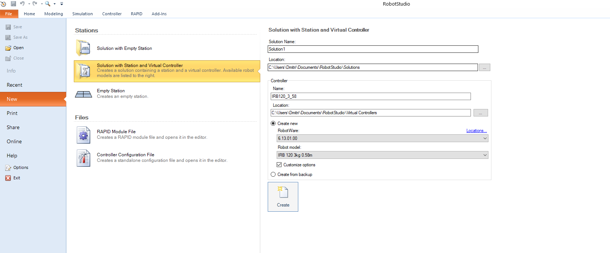
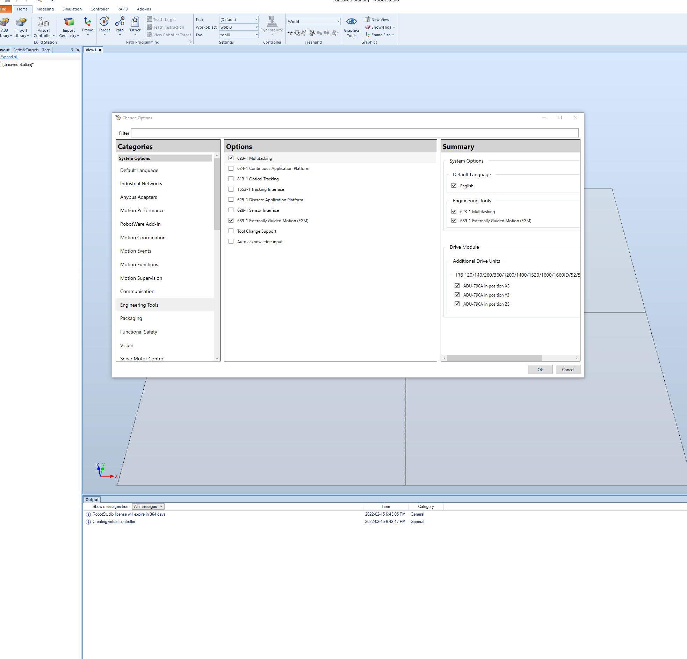

# Building the package in ROS2

Create a ROS2 workspace per the online tutorial. Clone this package into /src.

Import package dependencies:

    sudo apt update
    sudo apt dist-upgrade
    rosdep update
    cd /src
    vcs import < abb_ros2/abb.repos
    rosdep install -r --from-paths . --ignore-src --rosdistro $ROS_DISTRO -y

Quickly verify the build by launching RViz and viewing the robot:

    ros2 launch abb_irb1200_support view_robot.launch.py

# Simulating a robot in ROS2

For this simulation, ROS2 simulates the robot controllers. RobotStudio or a physical robot are not needed.

    ros2 launch abb_bringup abb_control.launch.py description_package:=abb_irb1200_support description_file:=irb1200_5_90.xacro launch_rviz:=false moveit_config_package:=abb_irb1200_5_90_moveit_config use_fake_hardware:=true

After launching the controllers, launch MoveIt:

    ros2 launch abb_bringup abb_moveit.launch.py robot_xacro_file:=irb1200_5_90.xacro support_package:=abb_irb1200_support

# RobotStudio Simulation

The simulation files are a modified version from the [abb_libegm library](https://github.com/ros-industrial/abb_libegm/issues/18#issuecomment-473262645) with some additional details about setting up EGM. 

Running this simulation requires two computers communicating over the network: a Windows computer running RobotStudio, and a ROS2 computer running the driver.

## Packaged Sim

The `robot_studio_resources` directory contains a Pack and Go file for RobotStudio, which packages the station with the virtual controller and add-in configuration. To set up the robot using the packaged solution:

1. Download `IRB1200_5_90.rspag` onto the computer with RobotStudio
2. Run RobotStudio
3. Under File, select Open
4. Navigate to the folder with the downloaded Pack and Go file and select it

This should open the station with most of the required parameters set up. However, note that network parameters for connecting between the robot and the control computer will likely be different, and will need to be reconfigured. See Step 3 in [Setting Up a New Robot](#setting-up-a-new-robot) to do this.

## Setting Up a New Robot:

These steps cover how to set up a new robot in RobotStudio to work with the ABB driver. If using the Pack and Go, skip to step 3 for network configuration, and then to step 6 to start the controller.

1. Open RobotStudio and create a new solution by selecting File --> New --> Solution with Station and Virtual Controller. Make sure you have `Customize options` selected.

2. In the window that pops up for controller customization, add EGM to the controller. This can be done by selecting `Engineering Tools` on the sidebar, and selecting the following options:
- `689-1 Externally Guided Motion (EGM)`
- (not sure if needed) `623-1 Multitasking`

3. Configure the communication settings for the controller to connect with the ROS2 computer. Identify the IP of the ROS2 computer, and the port used for EGM communitcation. The port is set by the `robotstudio_port` hardware parameter in the robot ros2_control description file. To configure the controller, navigate to the `Controller Tab` --> `Configuration` --> `Communication`. On the right, under `Transmission Protocol` right click and `Add new`.

 - Set the name to be `ROB_1`
 - Set the type to `UDPUC`. If you don't see this option, EGM was not added to the controller.
 -  Set the Remote Address to be that of the ROS2 computer. In the Pack and Go file, this is set to `169.254.53.52`, but this will likely need to be changed.
 - Set the Remote port number to match what ROS2 control driver is expecting. In the sample solution, it is set to `6511`.
 - Leave the local port number set to `0`
 - Press OK at the bottom of the window to confirm the changes

4. Add the code from `TRob1Main.mod` to the RAPID module. This can be done by selecting the module on the sidebar, and copy-pasting the code into the editor.

## Running the simulation

Once the simulation is set up, either via the Pack and Go or by setting up a new robot, the simulation should be ready to run.

Start the controller under the `RAPID` tab by selecting `TRob1Main` as the task under `Selected Tasks`, and pressing the `Start` icon on the ribbon.

The simulation will then try to connect with the ROS2 driver every few seconds. Once the connection is established, the simulated robot can be controlled from the ROS2 computer.

## Connecting with ROS2

To launch with RobotStudio, set `use_fake_hardware:=false`. As far as ROS is aware, RobotStudio is a real robot:

    ros2 launch abb_bringup abb_control.launch.py description_package:=abb_irb1200_support description_file:=irb1200_5_90.xacro launch_rviz:=false moveit_config_package:=abb_irb1200_5_90_moveit_config moveit_config_file:=abb_irb1200_5_90.srdf

After launching the controllers, launch MoveIt:

    ros2 launch abb_bringup abb_moveit.launch.py robot_xacro_file:=irb1200_5_90.xacro support_package:=abb_irb1200_support

## Troubleshooting

 - Occasionally, when connecting for the first time, you will need to stop the RAPID program and start it again
 - The warning message `41822 No data from the UdcUc device[*]` indicates a connection issue between the RobotStudio and the ROS2 computer
    - Check that the communication settings are correct
    - Test the connection between the computers by pinging the ROS2 computer from the RobotStudio computer and vice-versa
    - Check that the firewall settings on the RobotStudio computer allow communcation over UDP on the correct port
    - Verify that the ros2_control_node is listening on the correct UDP socket on the ROS2 computer
    - If using a container, verify that the required port is forwarded correctly
    - It may help switch the port by changing both the `robotstudio_port` hardware parameter on the ROS2 control side, and the port number under the `ROB_1` configuration on the RobotStudio side
