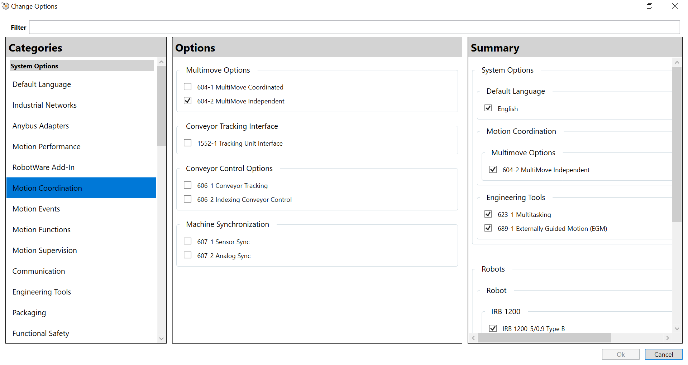
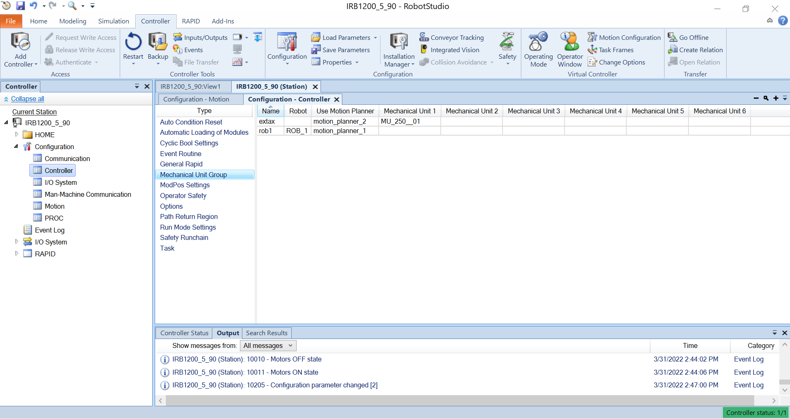
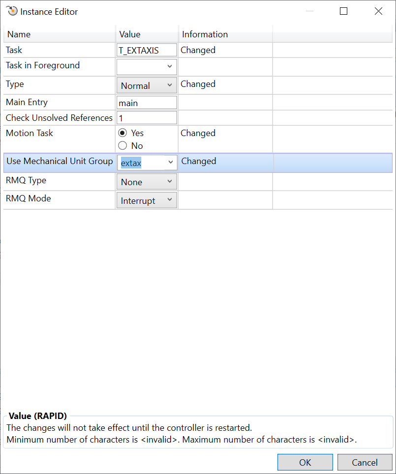
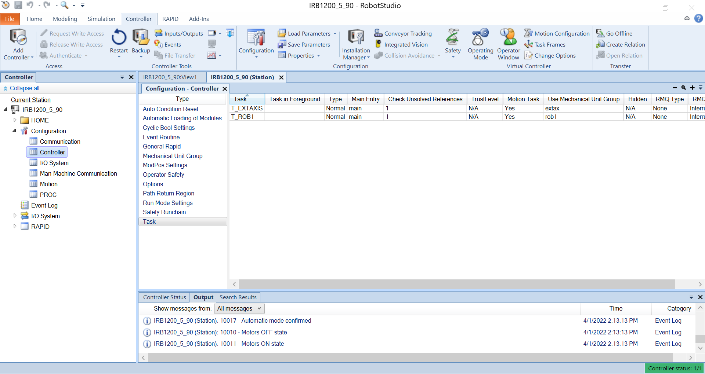

# Setting Up a New Robot

These steps cover how to set up a new robot in RobotStudio to work with the ABB driver, and reproduce the configurations in the included Pack and Go examples. If you don't want to configure your own RobotStudio simulation, you can use the Pack and Go example files as described in the [README](./README.md). As your network configuration will likely be different than that of the Pack and Go example, you will also need to follow the [controller configuration steps](#controller-configuration).

## Simulation Setup

1. Open RobotStudio and create a new solution by selecting `File` --> `New` --> `Solution with Station and Virtual Controller`. Make sure you have `Customize options` selected.


2. In the window that pops up for controller customization, add EGM to the controller. This can be done by selecting `Engineering Tools` on the sidebar, and selecting the following options:
- `689-1 Externally Guided Motion (EGM)`

For MultiMove support, e.g. for external axes, also select the following:
- `623-1 Multitasking` also under `Engineering Tools`
- `604-1 MultiMove Independent` under `Motion Coordination`

Note that EGM Position Stream does not support MultiMove Coordinated - this means that coordinated, synchronized robot movement is not supported (i.e. for tasks that involve multiple robots working on the same moving work object).


The following steps will cover how to set up the controller for EGM with a robot arm. To set up the controller configuration with a robot and external axis for MultiMove, see [Setting up a new MultiMove Robot](#setting-up-a-new-multimove-robot).

## Controller Configuration

3. Configure the communication settings for the controller to connect with the ROS2 computer. Identify the IP of the ROS2 computer, and the port used for EGM communication. The port is set by the `robotstudio_port` hardware parameter in the robot ros2_control description file. To configure the controller, navigate to the `Controller Tab` --> `Configuration` --> `Communication`. On the right, under `Transmission Protocol` right click and `Add new`.


 - Set the name to be `ROB_1`
 - Set the type to `UDPUC`. If you don't see this option, EGM was not added to the controller.
 - Set the Remote Address to be that of the ROS2 computer. In the Pack and Go file, this is set to `169.254.53.52`, but this will likely need to be changed.
 - Set the Remote port number to match what ROS2 control driver is expecting. In the sample solution, it is set to `6511`.
 - Leave the Local port number set to `0`
 - Press OK at the bottom of the window to confirm the changes


## RAPID Configuration

4. Add the code from `TRob1Main.mod` to the RAPID module. This can be done by selecting the module on the sidebar, and copy-pasting the code into the editor, or by right-clicking the `T_ROB1` task, selecting `Load Module...`, and navigate to and selecting `TRob1Main.mod` in the file browser. Optionally, if velocity control will be used, load `velocity_control_example/TRob1Main.mod`.


# Setting up a new MultiMove Robot

These steps cover how to set up a new robot with an example external axis in RobotStudio to work with the ABB driver. If using the Pack and Go, skip to steps 13 through 15 in [Controller Configuration](#controller-configuration-multimove) for network configuration.

## Simulation Setup (MultiMove)

1. Create a new solution similarly to the first step in the [Setting up a new robot](#setting-up-a-new-robot), enabling `604-2 MultiMove Independent` under Motion Coordination as well. You can also add MultiMove to an existing solution under the Controller option in the Ribbon, and select `Change Options`. Note that this will require a reset and restart of the controller, which will wipe the existing configuration and RAPID programs.



2. Navigate to the `Add-Ins tab` in the top ribbon. Search for the `External Axis Wizard` add-in and install it. Restart RobotStudio when prompted. We will use this wizard to help set up the controller configurations for the external axis.


3. Navigate to the `Home tab` in the top ribbon. Right-click the robot name in the left pane and select `Browse for Library...` A file browser should pop up.

4. Navigate to and open the external axis - the external axis used in the example Pack and Go is the `MU_250__01` in the `Positioners` folder. You should see the new mechanism appear in the View window.

5. Adjust the position of the external axis as necessary by right-clicking the new mechanism, `Position` --> `Set Position...` For the `MU_250__01`, we apply an orientation change of 180 about X axis and -90 about Y axis to put the unit under the robot. Click Apply when finished - you should see the external axis reposition according to the values you set.


6. On the top ribbon, open the `Virtual Controller` dropdown menu, and select the `External Axis Wizard` to configure the new axis.

    1. You should see a window pop up with two mechanisms: the arm and the external axis. Select both checkboxes and click `Next`.

    

    2. Configure settings for the motor units. To replicate the settings in the Pack and Go example, click `J1` on the left tree menu, and select `MU250` in the drop down menu for the Motor Unit, and click `Next`.

    

    3. Click the save button to save the configuration if desired. You can use this file to load the configuration again if you ever reset your controller. Click `Finish` to load the configuration to the system.

    

7. To attach the arm to the external axis, right click the arm name in the tree menu in the left pane, select `Attach to` --> `MU_250__01`. A pop up window will ask you to confirm if you want to update the position of the arm. Select Yes. A second pop up will ask if the robot should be coordinate with the track. Select Yes. A third prompt will ask you to restart the controller. Select Yes again.

## Controller Configuration (MultiMove)

8. Now that the external axis is set up in the controller, we now need to configure additional controller parameters to be able to control it via EGM. Go to the `Controller tab` on the top ribbon. On the left tree menu (or on the top ribbon), select `Configuration`, then `Motion`.

9. Click `Mechanical Unit` under the Type list. You should see two entries, one for the robot, and one for the external axis, similar to the screenshot below. Note the name of the external axis mechanical unit.

Your Mechanical Unit configuration should look like the screenshot below:


10. On the left tree menu (or on the top ribbon), select Configuration, then Controller.

11. Click Mechanical Unit Group under the Type list. Right-click to add a new Mechanical Unit Group. If you can't see the Mechanical Unit Group option, check if the [MultiMove option was enabled](#setting-up-a-new-multimove-robot).
    - Set the Mechanical Unit Group name. The Pack and Go example has uses the name `extax`
    - Select a unique motion planner (this cannot be the same as the motion planner for `ROB_1`). The Pack and Go example uses `motion_planner_2`
    - Set Mechanical Unit 1 to be the name of the external axis Mechanical Unit Group from above (`MU_250__01` in the example)


Your Mechanical Unit Group configuration should look similar to the screenshot below:



12. Click Task under the Type list. Right-click to add a new Task.

    - Set the task name. The example uses `T_EXTAXIS`
    - Set task type to `Normal`
    - Select the `Yes` radio button for `Motion Task`
    - Set `Use Mechanical Unit Group` to the name of the Mechanical Unit Group created earlier (`extax` in the example)



Your Task configuration should look similar to the screenshot below:



13. On the left tree menu (or on the top ribbon), select `Configuration`, then `Communication`

14. Click Transmission Protocol under the Type list. Right-click to add new Transmission Protocol

    - Add a UDPUC configuration for the arm similarly to the [previous example](#controller-configuration)
    - Add a new configuration for the external axis.
        - Set the Transmission Protocol name (`EXTAX` in the example)
        - Set the type to `UDPUC`. If you don't see this option, EGM was not added to the controller.
        -  Set the Remote Address to be that of the ROS2 computer. In the Pack and Go file, this is set to `169.254.53.52`, but this will likely need to be changed.
        - Set the Remote port number to match what ROS2 control driver is expecting (`6512` in the example).


Your Transmission Protocol configuration should look similar to the screenshot below:


15. Restart the controller to use the new configurations

## RAPID configuration (MultiMove)

Finally, we need to add a RAPID module for the new tasks we created.

16. On the left tree menu, expand the `RAPID` item. You should see two tasks that match the task names defined above.

    - Under `T_ROB1`, load the `TRob1Main` module similarly to [previous](#rapid-configuration)
    - Right-click the second task (`T_EXTAXIS` in the example), and select `Load Module...`
    - Navigate to and select `TExtAxis.mod`
    - In the module, change line 70 to reflect the Mechanical Unit name and the transmission protocol name if not using the same names as used in the example.

    ```EGMSetupUC <MECH UNIT NAME>, egm_id, "default", "<TRANSMISSION PROTOCOL NAME>", \Joint;```

    - Substitute `<MECH UNIT NAME>` with the Mechanical Unit name (`MU_250__1` in the example) and `<TRANSMISSION PROTOCOL NAME>` (keep the quotes around it) to the transmission protocol name (`EXTAX` in the example).
